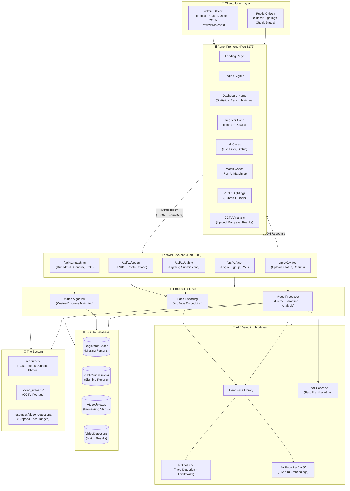
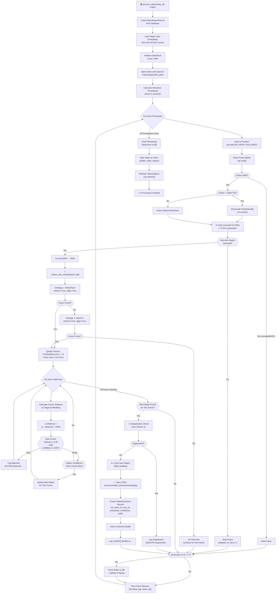
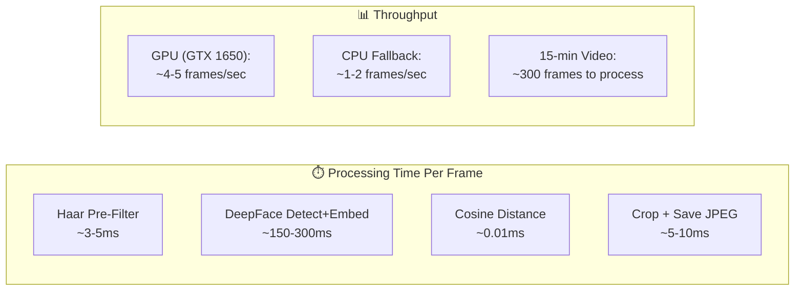
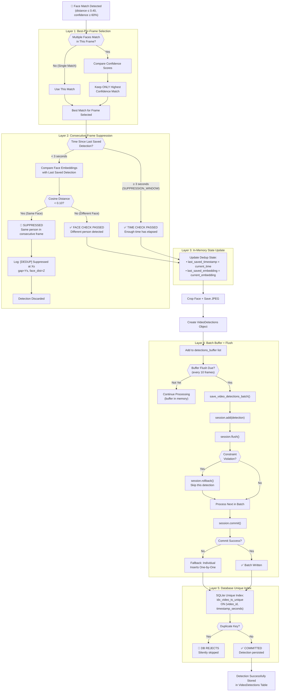
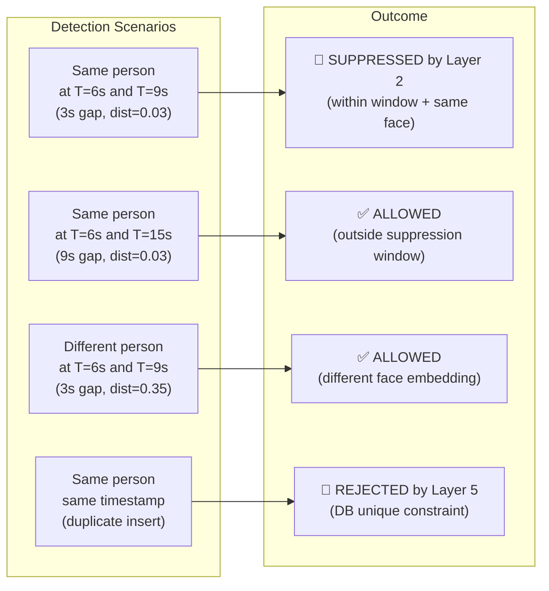
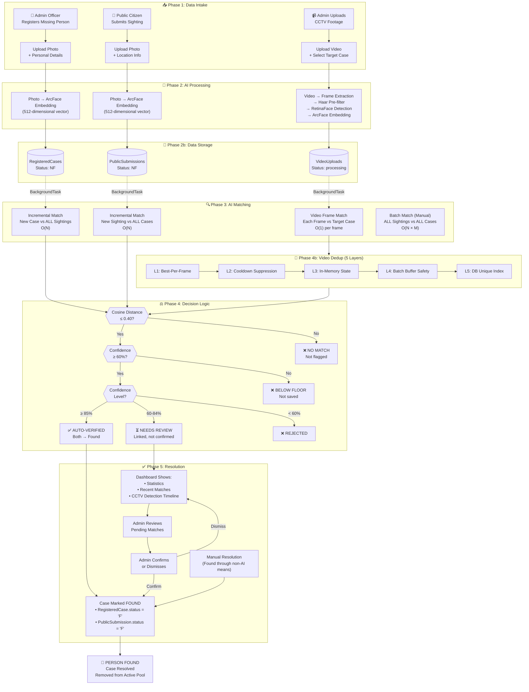
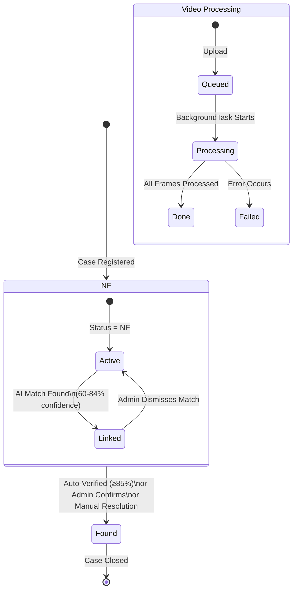
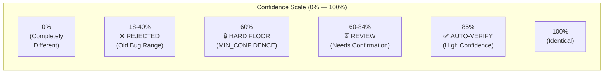

# Reunite AI 2.0 — System Flowcharts

> **Document Type:** Visual System Documentation  
> **Last Updated:** March 8, 2026  
> **Related:** [System Analysis](./system_analysis.md)

This document provides a comprehensive visual representation of the Reunite AI system internals using Mermaid flowcharts. Each section contains a detailed technical explanation of the subsystem followed by one or more flowcharts that illustrate the internal logic, data paths, and decision points.

---

## Table of Contents

1. [System Architecture Flowchart](#1-system-architecture-flowchart)
2. [Frame Processing Pipeline Flowchart](#2-frame-processing-pipeline-flowchart)
3. [Duplicate Detection Logic Flowchart](#3-duplicate-detection-logic-flowchart)
4. [Database Write Process Flowchart](#4-database-write-process-flowchart)
5. [API Request Handling Flowchart](#5-api-request-handling-flowchart)
6. [Complete End-to-End System Flow](#6-complete-end-to-end-system-flow)

---

## 1. System Architecture Flowchart

### Explanation

Reunite AI follows a **three-tier architecture** with clearly separated concerns:

**Client / User Layer:**  
Two types of users interact with the system — **Admin officers** who register missing persons, upload CCTV footage, and review AI matches, and **Public citizens** who submit anonymous sighting reports. Both interact through a React + TypeScript single-page application built with Vite and served on port 5173.

**API Layer (FastAPI):**  
The backend runs on FastAPI (port 8000) and exposes two API versions. The v1 API handles authentication, case management, public submissions, and face matching. The v2 API handles CCTV video upload, processing status polling, and detection result retrieval. All endpoints follow REST conventions with JSON request/response bodies and multipart form-data for file uploads. CORS is configured to accept requests from the frontend origin.

**Processing Layer:**  
This is the AI engine of the system. It consists of three core modules:
- **Match Algorithm** (`match_algo.py`) — Compares face embeddings using cosine distance. Supports both batch (all-vs-all) and incremental (one-vs-all) matching modes.
- **Video Processor** (`video_processor.py`) — The CCTV analysis pipeline that extracts frames, detects faces, generates embeddings, and identifies matches against a target missing person.
- **Face Encoding Utilities** (`utils.py`, inline in routers) — Extract 512-dimensional ArcFace embeddings from uploaded photos using DeepFace.

**Detection / AI Modules:**  
The AI stack is built on the DeepFace library, which wraps:
- **RetinaFace** — A multi-scale face detector that produces bounding boxes and facial landmarks. Used as the primary detector.
- **ArcFace (ResNet50)** — A face recognition model that generates 512-dimensional embedding vectors. Trained on the MS-Celeb-1M dataset.
- **Haar Cascade** — An OpenCV-based lightweight face detector used as a pre-filter (~3ms) to skip frames with no faces before invoking the heavier DeepFace pipeline.

**Database Layer:**  
SQLite is used as the persistent data store, accessed through SQLModel (a Pydantic + SQLAlchemy hybrid ORM). Four tables store all system data:
- `RegisteredCases` — Missing persons registered by admin officers
- `PublicSubmissions` — Sighting reports from the public
- `VideoUploads` — CCTV video upload metadata and processing status
- `VideoDetections` — Individual face detections from processed videos

**Response Layer:**  
Results flow back through the API as structured JSON responses. For long-running operations (video processing, background matching), the system uses FastAPI's `BackgroundTasks` to process asynchronously while returning an immediate response with a status polling endpoint.



---

## 2. Frame Processing Pipeline Flowchart

### Explanation

The frame processing pipeline is the core of the Phase 2 CCTV analysis system, implemented in `video_processor.py`. It processes uploaded CCTV videos to find a specific missing person.

**Step 1 — Video Initialization:**  
When `process_video(video_id)` is called as a background task, it first loads the video upload record from the database to get the file path, target case ID, and confidence threshold. It then loads the target case's 512-dimensional ArcFace embedding from the `RegisteredCases` table.

**Step 2 — Frame Extraction Schedule:**  
The video is opened with OpenCV's `VideoCapture`. The system calculates extraction timestamps at intervals of `FRAME_INTERVAL_SECONDS` (3 seconds). For a 5-minute video at 30fps, this means ~100 frames to process instead of 9,000 — a 99% reduction in processing load.

**Step 3 — Frame Read and Resize:**  
For each timestamp, OpenCV seeks to the position and reads the frame in BGR format. If the frame dimensions exceed 1280×720, it is downscaled proportionally. Smaller frames are kept at original resolution to preserve CCTV quality.

**Step 4 — Haar Cascade Pre-filter:**  
Before invoking the expensive DeepFace pipeline (~200ms), a lightweight Haar cascade runs on the grayscale frame (~3-5ms). If no face-like region is detected, the frame is immediately skipped. This eliminates 60-80% of frames (empty corridors, walls, vehicles).

**Step 5 — Deep Face Detection and Embedding:**  
For frames that pass the pre-filter, the BGR frame is converted to RGB and passed to `_detect_and_embed()`. This function uses a multi-strategy approach:
1. **Strategy 1:** RetinaFace with enforce_detection=True and alignment — the most accurate approach
2. **Strategy 2:** OpenCV detector with enforce_detection=True — fallback for when RetinaFace fails

Each detected face produces a 512-dimensional embedding. Quality checks filter out garbage embeddings (norm < 1.0) and tiny faces (< 15×15 pixels).

**Step 6 — Cosine Distance Matching:**  
Each valid face embedding is compared against the target case embedding using cosine distance: `distance = 1 - (dot(a, b) / (||a|| × ||b||))`. The confidence is calculated as `(1 - distance) × 100%`.

**Step 7 — Two-Gate Threshold:**  
A detection passes only if BOTH conditions are met:
- `distance ≤ 0.40` (the configurable threshold)
- `confidence ≥ 60%` (the hard floor, MIN_CONFIDENCE_PERCENT)

This two-gate approach prevents edge cases where numeric precision could allow low-confidence detections through.

**Step 8 — Best-Per-Frame Selection:**  
If multiple faces in a single frame match the target, only the one with the highest confidence is kept. This prevents noisy multi-detection scenarios.

**Step 9 — Deduplication:**  
The selected detection is checked against the consecutive-frame suppression window (see Section 3).

**Step 10 — Face Cropping and Saving:**  
If the detection passes dedup, the face region is cropped from the RGB frame with 20-pixel padding, converted to BGR, and saved as a JPEG at quality 90 to `resources/video_detections/{uuid}.jpg`.

**Step 11 — Buffered Database Write:**  
The detection is added to an in-memory buffer. Every 10 frames, the buffer is flushed to the database (see Section 4) and progress is updated.



### Performance Characteristics



---

## 3. Duplicate Detection Logic Flowchart

### Explanation

Duplicate detection is one of the most critical subsystems in the video processing pipeline. Without it, a person standing in front of a CCTV camera for 30 seconds would generate 10 nearly identical detection entries (one every 3 seconds). The system implements a **5-layer deduplication architecture** where each layer acts as a progressively stronger safety net.

**Layer 1 — Best-Per-Frame Selection:**  
When multiple faces in a single frame match the target person (e.g., the target face appears alongside another similar-looking person), only the face with the **highest confidence score** is selected. This is implemented by tracking `best_frame_match` as a tuple of `(distance, confidence, embedding, facial_area)` and updating it only when a higher confidence is found. This layer prevents multiple detections from a single video frame.

**Layer 2 — Consecutive-Frame Suppression (Cooldown Logic):**  
This is the primary deduplication mechanism. It works by tracking two values:
- `last_saved_timestamp` — The video timestamp (in seconds) of the most recently saved detection
- `last_saved_embedding` — The 512-dim face embedding of the most recently saved detection

When a new detection passes Layer 1, the system checks:
1. **Time gap check:** Is `current_timestamp - last_saved_timestamp < SUPPRESSION_WINDOW_SEC (3 seconds)`?
2. **Face similarity check:** Is `cosine_distance(current_embedding, last_saved_embedding) < SUPPRESSION_SIMILARITY (0.10)`?

If BOTH conditions are true, the detection is **suppressed** — it's the same person in a consecutive frame within the cooldown window. If either condition fails (enough time has passed OR the face is sufficiently different), the detection is allowed through.

The 3-second suppression window was chosen because `FRAME_INTERVAL_SECONDS` is also 3 seconds, meaning this layer specifically targets the scenario where the same face appears at timestamp T and again at T+3.

The 0.10 similarity threshold is deliberately very low (strict). Two embeddings of the same person from slightly different angles typically have a cosine distance of 0.02-0.08. The 0.10 threshold ensures suppression only happens for genuinely identical faces.

**Layer 3 — In-Memory Dedup State:**  
The `last_saved_timestamp` and `last_saved_embedding` variables act as an in-memory deduplication cache. They are updated every time a detection is successfully saved, creating a running memory of the most recent detection. This is inherently tied to Layer 2 but provides the state tracking mechanism.

**Layer 4 — Batch Buffer with Flush Safety:**  
Detections are accumulated in `detections_buffer` (a Python list) and flushed to the database every 10 frames. The `save_video_detections_batch()` function uses session-level error handling:
- Each detection is added with `session.add()` + `session.flush()` to catch constraint violations early
- If a constraint violation occurs, that specific detection is rolled back and skipped
- If the final `session.commit()` fails, a fallback path attempts individual inserts for each remaining detection

**Layer 5 — Database-Level Unique Constraint:**  
The ultimate safety net is a unique index on the `videodetections` table:
```sql
CREATE UNIQUE INDEX idx_video_ts_unique ON videodetections(video_id, timestamp_seconds)
```
This is created by `ensure_video_detections_index()` before processing begins. Even if all application-level dedup fails, the database will reject any duplicate `(video_id, timestamp_seconds)` combination.



### Dedup Decision Matrix



---

## 4. Database Write Process Flowchart

### Explanation

The database write process in Reunite AI handles multiple types of write operations across four tables. Each write path has distinct validation, error handling, and confirmation logic.

**Case Registration Write:**  
When an admin registers a new missing person case, the system: (1) saves the uploaded photo to `resources/{uuid}.jpg`, (2) extracts the ArcFace embedding from the photo using DeepFace, (3) validates that a face was detected (returns 400 if not), (4) serializes the 512-dim embedding as a JSON string, (5) creates a `RegisteredCases` record with status `'NF'` (Not Found), and (6) triggers a background matching task. The embedding is stored in the `face_mesh` column as a JSON array string (e.g., `"[0.032, -0.145, ...]"`).

**Public Submission Write:**  
Nearly identical to case registration but creates a `PublicSubmissions` record. The key difference is that the background matching task searches in the opposite direction — comparing the new sighting against all registered cases.

**Video Detection Write (Batched):**  
Video detections use a batched write strategy to minimize I/O overhead during processing. Detections are accumulated in a Python list buffer and flushed every 10 frames. The batch write function (`save_video_detections_batch`) implements a defensive three-tier strategy:
1. **Optimistic batch:** Try to add and flush all detections in a single transaction
2. **Per-record recovery:** If a flush fails (typically a unique constraint violation), roll back and skip that specific record
3. **Individual fallback:** If the overall commit fails, open a new session for each detection and attempt individual inserts

**Status Update Write:**  
The `update_video_status()` function updates the `VideoUploads` table during processing. It uses partial updates — only non-None fields are modified. This is called at three lifecycle points: when processing starts (`status='processing'`), every 10 frames (progress update), and when processing completes (`status='done'` with `completed_at` timestamp).

**Match Persistence Write:**  
When a match is found between a registered case and a public submission, the persistence strategy depends on the confidence level:
- **≥ 85% confidence:** Both records are updated — the registered case gets `status='F'` and `matched_with=public_id`, and the public submission gets `status='F'`. This is a full confirmation (auto-verified).
- **60-84% confidence:** Only the registered case's `matched_with` field is updated (linking it to the public submission) but the status remains `'NF'`. An admin must manually confirm the match.

```mermaid
flowchart TD
    subgraph CaseWrite["📝 Case Registration Write"]
        CW1["Receive Photo + Form Data"] --> CW2["Save Photo to\nresources/{uuid}.jpg"]
        CW2 --> CW3["Extract ArcFace Embedding\nDeepFace.represent()"]
        CW3 --> CW4{{"Face Detected?"}}
        CW4 -->|"No"| CW5["Delete Saved Photo\nReturn 400 Error"]
        CW4 -->|"Yes"| CW6["Serialize Embedding\njson.dumps(embedding)"]
        CW6 --> CW7["Create RegisteredCases Object\n(id, name, face_mesh, status='NF')"]
        CW7 --> CW8["session.add(case)\nsession.commit()"]
        CW8 --> CW9["Trigger Background Matching\nBackgroundTasks.add_task()"]
        CW9 --> CW10["Return 201 CaseResponse"]
    end

    subgraph DetectionWrite["📹 Video Detection Batch Write"]
        DW1["Detection Passes\nAll Dedup Layers"] --> DW2["Create VideoDetections Object\n(id, video_id, case_id,\ntimestamp, confidence, path)"]
        DW2 --> DW3["Add to In-Memory Buffer"]
        DW3 --> DW4{{"Every 10 Frames?"}}
        DW4 -->|"No"| DW5["Continue Processing"]
        DW4 -->|"Yes"| DW6["save_video_detections_batch()"]
        DW6 --> DW7["For Each Detection\nin Buffer:"]
        DW7 --> DW8["session.add(detection)"]
        DW8 --> DW9["session.flush()"]
        DW9 --> DW10{{"Constraint\nViolation?"}}
        DW10 -->|"Yes"| DW11["session.rollback()\nLog Warning\nSkip Record"]
        DW10 -->|"No"| DW12["Continue to\nNext Detection"]
        DW11 --> DW12
        DW12 --> DW13{{"All Processed?"}}
        DW13 -->|"No"| DW8
        DW13 -->|"Yes"| DW14["session.commit()"]
        DW14 --> DW15{{"Commit OK?"}}
        DW15 -->|"Yes"| DW16["✅ Batch Written\nClear Buffer"]
        DW15 -->|"No"| DW17["Fallback: Open New Session\nInsert One-by-One"]
        DW17 --> DW16
    end

    subgraph MatchWrite["🔗 Match Persistence Write"]
        MW1["Match Found\n(distance ≤ threshold)"] --> MW2["Calculate Confidence\n(1 - distance) × 100%"]
        MW2 --> MW3{{"Confidence Level?"}}
        MW3 -->|"≥ 85%"| MW4["AUTO-VERIFY:\nupdate_found_status()"]
        MW4 --> MW5["Set RegisteredCase.status = 'F'\nSet RegisteredCase.matched_with = pub_id\nSet PublicSubmission.status = 'F'"]
        MW5 --> MW6["session.commit()"]
        MW3 -->|"60-84%"| MW7["LINK ONLY:\nupdate_matched_with()"]
        MW7 --> MW8["Set RegisteredCase.matched_with = pub_id\n(Status stays 'NF')"]
        MW8 --> MW9["session.commit()"]
        MW3 -->|"< 60%"| MW10["REJECTED:\nNot persisted\nLog rejection"]
    end

    subgraph StatusWrite["📊 Video Status Update Write"]
        SW1["Processing Event"] --> SW2{{"Event Type?"}}
        SW2 -->|"Start"| SW3["status='processing'"]
        SW2 -->|"Progress"| SW4["processed_frames=N\ntotal_detections=M"]
        SW2 -->|"Complete"| SW5["status='done'\ncompleted_at=now"]
        SW2 -->|"Error"| SW6["status='failed'\nerror_message=msg"]
        SW3 --> SW7["update_video_status()"]
        SW4 --> SW7
        SW5 --> SW7
        SW6 --> SW7
        SW7 --> SW8["session.get(VideoUploads, id)"]
        SW8 --> SW9["Update Non-None Fields"]
        SW9 --> SW10["session.commit()"]
    end
```



---

## 5. API Request Handling Flowchart

### Explanation

The Reunite AI API layer is built on FastAPI and handles six distinct categories of requests, each with different validation, processing, and response patterns.

**Authentication Flow (POST /api/v1/auth/login):**  
The login endpoint accepts a username and password. It first attempts to verify against the YAML-based credentials file (`login_config.yml`) — this provides backward compatibility. If the user is found in the YAML, their profile data (name, role, area, city) is extracted. If not, the system falls back to demo mode (accepting any credentials for development). A JWT token is generated with a 24-hour expiry containing the user's ID and name, and returned alongside the user profile object.

**Case Management Flow (POST /api/v1/cases):**  
Case registration is a multi-step process: receive the multipart form data (photo + fields), save the photo to disk, extract the face embedding in a thread pool (to avoid blocking the async event loop), validate a face was detected, create the database record, trigger background matching, and return the response. The face encoding extraction runs in `run_in_threadpool()` because DeepFace uses TensorFlow which requires dedicated thread handling.

**Public Submission Flow (POST /api/v1/public):**  
Structurally identical to case registration but creates a `PublicSubmissions` record and triggers matching in the opposite direction (new sighting vs. all registered cases).

**Matching Flow (POST /api/v1/matching/run):**  
Batch matching loads all public and registered embeddings, computes pairwise distances, and returns matched pairs. The O(N×M) operation runs in a thread pool. The incremental matching (`match_one_against_all`) is triggered automatically by case/submission creation and runs as a background task.

**Video Analysis Flow (POST /api/v2/video/upload):**  
Video upload validates the case existence, saves the file to disk, validates the video file (format, size, duration, playability), creates the upload record, and starts background processing. The processing status is polled via `GET /status/{id}` which returns frame progress and detection count from the database. Results are fetched via `GET /results/{case_id}` which joins `VideoDetections` with `VideoUploads` to include CCTV location metadata.

**Statistics Flow (GET /api/v1/statistics):**  
Dashboard statistics run four COUNT queries against the `RegisteredCases` table — total cases, found cases (status='F'), active cases (status='NF'), and AI-matched cases (matched_with IS NOT NULL).

```mermaid
flowchart TD
    CLIENT["🌐 Client Request"] --> ROUTER{{"API Router\nDispatch"}}

    ROUTER -->|"/api/v1/auth/*"| AUTH_FLOW
    ROUTER -->|"/api/v1/cases/*"| CASES_FLOW
    ROUTER -->|"/api/v1/public/*"| PUBLIC_FLOW
    ROUTER -->|"/api/v1/matching/*"| MATCH_FLOW
    ROUTER -->|"/api/v2/video/*"| VIDEO_FLOW
    ROUTER -->|"/api/v1/statistics"| STATS_FLOW

    subgraph AUTH_FLOW["🔐 Authentication Flow"]
        A1["POST /auth/login"] --> A2["Parse LoginRequest\n(username, password)"]
        A2 --> A3["Check YAML Config\n(login_config.yml)"]
        A3 --> A4{{"User Found\nin YAML?"}}
        A4 -->|"Yes"| A5["Extract User Profile\n(name, role, area, city)"]
        A4 -->|"No"| A6["Demo Mode Fallback\n(Accept any credentials)"]
        A5 --> A7["Generate JWT Token\n(24hr expiry, HS256)"]
        A6 --> A7
        A7 --> A8["Return TokenResponse\n(token + user object)"]
    end

    subgraph CASES_FLOW["📋 Case Management Flow"]
        C1["POST /cases"] --> C2["Read Photo Bytes\n+ Form Fields"]
        C2 --> C3["Save Photo to Disk\nresources/{uuid}.jpg"]
        C3 --> C4["Extract Face Embedding\n(ThreadPool → DeepFace)"]
        C4 --> C5{{"Face Detected?"}}
        C5 -->|"No"| C6["Delete Photo\nReturn 400 Error"]
        C5 -->|"Yes"| C7["Create RegisteredCases\nRecord in DB"]
        C7 --> C8["Trigger BackgroundTask:\nmatch_one_against_all()"]
        C8 --> C9["Return 201\nCaseResponse"]

        C10["GET /cases"] --> C11{{"Filters?"}}
        C11 -->|"submitted_by"| C12["fetch_registered_cases()"]
        C11 -->|"status=NF"| C13["fetch_all_not_found()"]
        C11 -->|"status=All"| C14["fetch_all_registered()"]
        C12 --> C15["Map to CaseResponse[]"]
        C13 --> C15
        C14 --> C15

        C16["PATCH /cases/{id}/found"] --> C17["mark_case_as_found()"]
        C17 --> C18["Return Success"]

        C19["DELETE /cases/{id}"] --> C20["Delete DB Record\n+ Photo File"]
        C20 --> C21["Return Deleted"]
    end

    subgraph PUBLIC_FLOW["👥 Public Submission Flow"]
        P1["POST /public"] --> P2["Read Photo + Form"]
        P2 --> P3["Save Photo to Disk"]
        P3 --> P4["Extract Face Embedding\n(ThreadPool)"]
        P4 --> P5{{"Face Detected?"}}
        P5 -->|"No"| P6["Delete + Return 400"]
        P5 -->|"Yes"| P7["Create PublicSubmissions\nRecord in DB"]
        P7 --> P8["Trigger BackgroundTask:\nmatch_one_against_all(type='public')"]
        P8 --> P9["Return 201\nSubmissionResponse"]
    end

    subgraph MATCH_FLOW["🧠 Matching Flow"]
        M1["POST /matching/run"] --> M2["Load All NF Public\nEmbeddings"]
        M2 --> M3["Load All NF Registered\nEmbeddings"]
        M3 --> M4["Pairwise Cosine Distance\nO(N × M) in ThreadPool"]
        M4 --> M5["Filter by Threshold\n+ Confidence Floor"]
        M5 --> M6["Persist Matches to DB\n(Auto-verify ≥85%)"]
        M6 --> M7["Return MatchResult\n(matched pairs)"]

        M8["POST /matching/confirm"] --> M9["update_found_status()\n(Both → 'F')"]
        M9 --> M10["Return Confirmed"]
    end

    subgraph VIDEO_FLOW["📹 Video Analysis Flow"]
        V1["POST /v2/video/upload"] --> V2["Validate Case Exists"]
        V2 --> V3["Save Video File\nvideo_uploads/{uuid}.ext"]
        V3 --> V4["Validate Video\n(format, size, duration)"]
        V4 --> V5{{"Valid?"}}
        V5 -->|"No"| V6["Delete File\nReturn 400"]
        V5 -->|"Yes"| V7["Create VideoUploads\nRecord (status='queued')"]
        V7 --> V8["Start BackgroundTask:\nprocess_video()"]
        V8 --> V9["Return 201\n(video_id + status)"]

        V10["GET /v2/video/status/{id}"] --> V11["Query VideoUploads"]
        V11 --> V12["Calculate Progress %\n(processed / total × 100)"]
        V12 --> V13["Return StatusResponse"]

        V14["GET /v2/video/results/{case_id}"] --> V15["Query VideoDetections\n+ Join VideoUploads"]
        V15 --> V16["Build DetectionItems\n(timestamps, URLs, locations)"]
        V16 --> V17["Return ResultsResponse"]
    end

    subgraph STATS_FLOW["📊 Statistics Flow"]
        S1["GET /statistics"] --> S2["COUNT total_registered"]
        S2 --> S3["COUNT found_cases"]
        S3 --> S4["COUNT active_cases"]
        S4 --> S5["COUNT ai_matches"]
        S5 --> S6["Return StatisticsResponse"]
    end
```



---

## 6. Complete End-to-End System Flow

### Explanation

This section presents the complete lifecycle of the Reunite AI system from the moment a missing person is registered through to their recovery. The system operates on three parallel intake channels — admin case registration, public sighting submission, and CCTV video analysis — all converging into a unified AI matching and resolution pipeline.

**Phase 1 — Data Intake:**  
The system ingests data through three channels. An admin officer registers a missing person with a photo and personal details. A public citizen submits a sighting report with a photo and location. An admin uploads CCTV footage targeting a specific case.

**Phase 2 — AI Processing:**  
Each intake channel triggers AI processing. For photos (cases and sightings), a 512-dim ArcFace embedding is extracted immediately. For CCTV video, a background pipeline extracts frames every 3 seconds, pre-filters with Haar cascade, and runs face detection + embedding on candidate frames.

**Phase 3 — Matching:**  
All matching uses cosine distance on ArcFace embeddings. Incremental matching (triggered on every new submission) runs O(N) against the opposite set. Batch matching runs O(N×M) across all cases. Video matching runs O(1) per frame against a single target case.

**Phase 4 — Decision and Resolution:**  
Matches are classified by confidence: ≥85% are auto-verified, 60-84% need admin review, and <60% are rejected. CCTV detections pass through 5-layer dedup before storage. Auto-verified matches immediately update both case statuses to "Found".

**Phase 5 — Notification and Review:**  
The admin dashboard displays statistics, recent matches, and CCTV detection timelines. Admins can review pending matches, confirm or dismiss them, and manually mark cases as found through non-AI channels.



### System State Transitions



### Confidence Threshold Visualization



---

## Appendix A — File Index

| File | Lines | Purpose |
|---|---|---|
| `backend/main.py` | 78 | FastAPI app, CORS, router registration |
| `backend/api/routers/auth.py` | 158 | JWT authentication |
| `backend/api/routers/cases.py` | 298 | Case CRUD + face encoding |
| `backend/api/routers/public.py` | 212 | Public submission CRUD |
| `backend/api/routers/matching.py` | 165 | Matching + statistics API |
| `backend/api/routers/video.py` | 233 | Video analysis API (Phase 2) |
| `backend/pages/helper/video_processor.py` | 553 | CCTV processing pipeline |
| `backend/pages/helper/match_algo.py` | 331 | Face matching algorithm |
| `backend/pages/helper/db_queries.py` | 502 | Database operations layer |
| `backend/pages/helper/data_models.py` | 94 | ORM model definitions |
| `backend/pages/helper/utils.py` | 63 | Image utilities |
| `backend/pages/helper/train_model.py` | 67 | Data validation |
| `backend/pages/helper/model_cache.py` | 1 | Empty (deprecated) |
| `backend/verify_fixes.py` | 160 | API verification script |
| `backend/verify_match.py` | 29 | Match verification script |
| `frontend/src/app/App.tsx` | 44 | React router + routes |
| `frontend/src/app/services/api.ts` | 364 | Centralized API client |
| `frontend/src/app/pages/dashboard/*.tsx` | 7 pages | Dashboard views |

---

> **Document generated for Reunite AI 2.0 — March 2026**  
> **Source:** System analysis of the complete codebase and all development history
